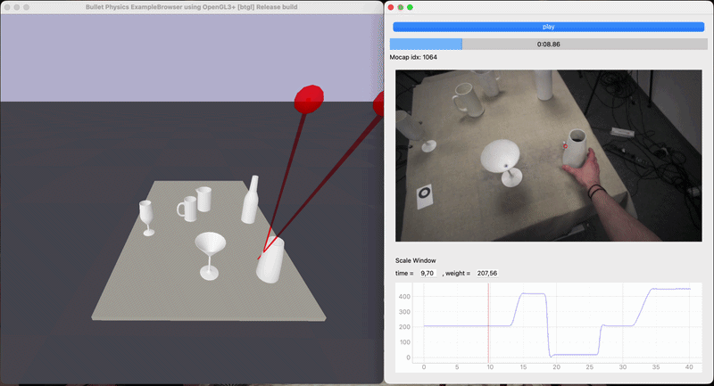

# Human Pouring Control

Code to reproduce the figures for **"How to pour a cup of coffee"**
*Niteesh Midlagajni, Roland W. Fleming, Constantin A. Rothkopf*

## Contents

This repo contains the analysis and plotting notebooks used to generate the
behavioral and modeling figures in the paper. Preprocessed data is hosted on
Zenodo and downloaded automatically when you run the notebooks.

- `behavioural_plots.ipynb` — behavioral figures (Figures 1, 2, 3).
- `model_plots.ipynb` — SINDYc dynamics fits, iLQG controller fits, and inverse
  optimal control results: recovered parameters, model comparison, and the
  signal-dependent-noise ablation (Figures 4 and 5).
- `controller_helper.py` — SINDYc forward dynamics equations and iLQG
  simulation wrappers for each container–vessel combination.
- `utils.py` — shared data loading and plotting utilities.


## Data

Preprocessed data is hosted on Zenodo: [10.5281/zenodo.22163061](https://doi.org/10.5281/zenodo.22163061).
The first cell of each notebook downloads and extracts it into `data/`
automatically if it isn't already present.

## Dependencies

iLQG solver come from
[`nioc-pouring`](https://github.com/RothkopfLab/nioc-pouring), our fork of the
 [`nioc`](https://github.com/RothkopfLab/nioc-neurips) library that includes all the container-vessel pouring environments. This is installed automatically as a project dependency.

## Setup

This project uses `uv` to install and run.

```bash
git clone https://github.com/RothkopfLab/human-pouring-control.git
cd human-pouring-control
uv sync
uv run jupyter lab
```

Open `behavioural_plots.ipynb` or `model_plots.ipynb` and run.

## Raw Data Playback



For replaying and visualizing the raw mocap, scale, and gaze data, see
[`pouring_data_playback`](https://github.com/RothkopfLab/pouring_data_playback).


## Citation

```bibtex
@article{midlagajni2026pouring,
  title={How to pour a cup of coffee},
  author={Midlagajni, Niteesh and Fleming, Roland W. and Rothkopf, Constantin A.},
  journal={bioRxiv},
  year={2026},
  doi={10.64898/2026.08.26.746627},
  url={https://www.biorxiv.org/content/10.64898/2026.08.26.746627v1}
}
```